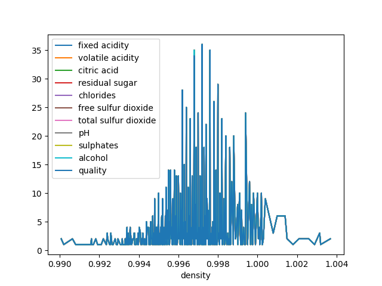
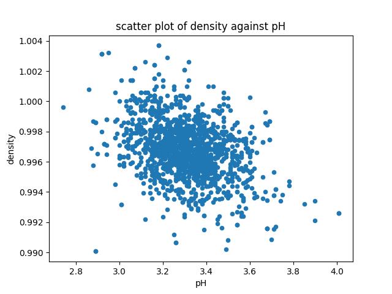
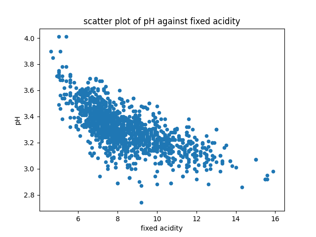

# REPORT ON GRAPHS AND PLOTS
---
### __Plot Diagram of Density

- A graph displaying density as the grouping
- The highest density recorded is seen to be around 0.997 with a count around 35

### __Scatter Diagram of density against pH__

- The graph above is a scatter plot of density against pH

### __Bar graph of quality values

-The graph above displays the quality values in a bar graph.
-The graph disaplays the first 50 rows of the data set since a large database is being worked on.

### __Scatter Plot of ph against fixed acidity

-This plot shows a scatter diagram of pH against fixed acidity of the wine.
-Negative correlation exists in this scatter plot
-The concentration is most defined between 3.0 and 3.6 on pH axis and most defined between 6 and 12 on the fixed acidity axis
